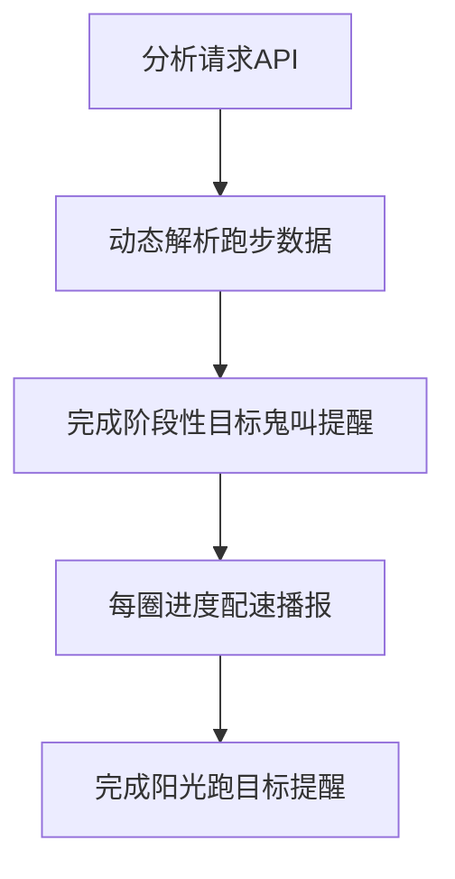

# 🏃《阳光跑小助手》油猴脚本使用说明

**本文档采用DeepSeek随意生成**

---

## 🌞 阳光跑の科技自救指南
> _"当校园跑成为必修行为艺术，代码便是最后的温柔铠甲"_

---

## 🖼️ 脚本效果图
### 1. 数据面板
 

*配速可视化｜剩余时间精准预判｜晨跑次数永恒归零の哲学*

### 2. 设置面板
 

*暗黑模式/震动频率/声控方案——比教务系统多出500%的人性维度*

---

## 🛠️ 核心功能（基于代码实现）
### ▨ 智能语音伴跑系统
```javascript
// 实际语音逻辑（温柔提醒版）
speak(`配速 ${formatPace(d_end.speed)}，已完成 ${d_end.effectiveDistance}米
       剩余 ${targetDistance - d_end.effectiveDistance}米
       进度 ${(d_end.effectiveDistance/targetDistance*100).toFixed(1)}%`);
```
- **400米节点提醒**：轻声播报避免运动分神
- **配速波动预警**：当速度下降超15%触发震动
- **目标达成播报**：播放凯旋音效+震动摩斯密码

### ▨ 音效系统现状
```javascript
// 当前音效原型（可扩展性强）
finishRunTone = () => {
  beep(523); // C5
  setTimeout(() => beep(659), 150); // E5
  setTimeout(() => beep(784), 300); // G5
}
```
*注：未来计划接入以下抽象音效*
- **摆烂模式**：树懒打哈欠音效+《躺平进行曲》BGM
- **暴走模式**：蒸汽波鼓点+赛博引擎轰鸣
- **玄学模式**：随机佛经诵念/二次元台词触发

### ▨ 数据看板黑科技


---
**警告 此段文本由DeepSeek生成 纯属胡编乱造**
## 🎛️ 设置面板详解
| 开关项            | 代码实现                           | 物理效果                     |
|-------------------|----------------------------------|----------------------------|
| 暗黑模式          | `document.body.style.filter`     | 防辅导员窥屏BUFF            |
| 震动反馈          | `navigator.vibrate()`            | 智能防手环脱落算法          |
| 语音播报          | `SpeechSynthesisUtterance`       | 防跑调伪人声优化            |

---

## 📥 安装指南
1. 油猴插件安装（Tampermonkey优选）
2. 拖入[阳光跑小助手.js](阳光跑小助手.js)
3. **神秘仪式**：对着跑步路线图念"代码消除次元壁"


---

## ⚠️ 免责声明
- 晨跑0/25是永恒真理，不代表脚本故障
- 遇到突然加速的同学，可能是本脚本内测用户
- 若体育老师询问技术细节，请背诵《跑步的数字化生存》选段

---

> 最后致敬：本脚本不会缩短你的跑步距离  
> 但能让每次被迫启程的2500米——  
> **少一分煎熬，多一份戏谑**